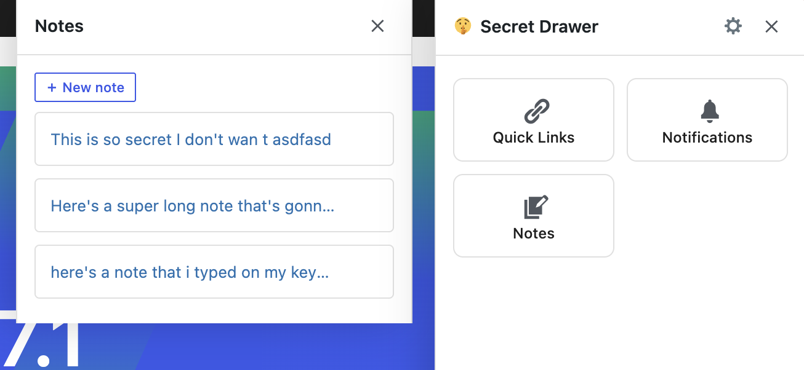
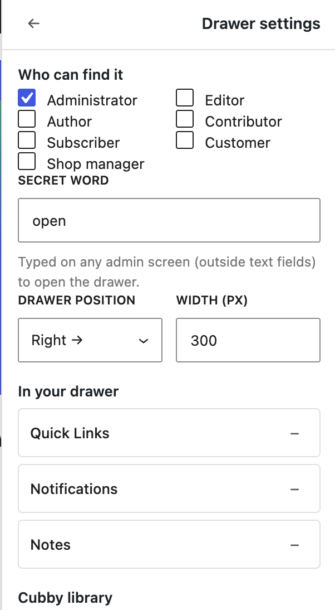
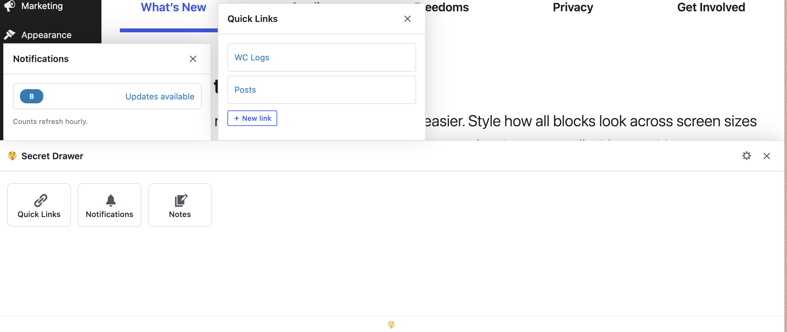

# Secret Drawer 🤫

A hidden drawer in wp-admin, unlocked by a secret word. Silly to find,
genuinely useful to have.

> **Status:** in early development (0.1.0). See [PLAN.md](PLAN.md) for the
> full implementation plan and roadmap.

Type the secret word on any wp-admin page and a drawer slides in from the
edge: your notes, your quick links, site notifications — whatever you've
tucked away. Nobody else sees it. Nobody else knows it's there.

## Screenshots






## Requirements

- WordPress 6.4+
- PHP 7.4+

## Development

No build step: plain PHP, plain JS (`wp-components` via
`wp.element.createElement`), one CSS file. No npm.

```bash
# Lint all PHP
find . -name '*.php' ! -path './vendor/*' -exec php -l {} \;
```

## Extending

Other plugins can add their own cubbies and levers with one filter —
see [SECRET-DRAWER-EXTENDING.md](SECRET-DRAWER-EXTENDING.md).

## License

GPL-2.0-or-later